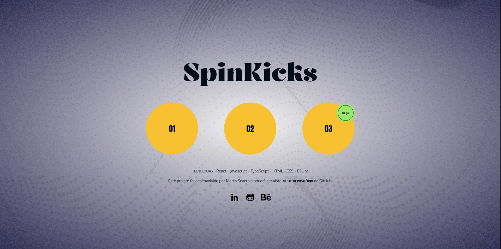

# Cursor Customizado em React: Design e Funcionalidade para um Site Mais Interativo

**Personalizar o cursor de um site** é uma maneira simples e poderosa de enriquecer a experiência do usuário. Muitas vezes, o cursor padrão passa despercebido, mas ao **criar um cursor customizado**, é possível tornar a **navegação mais envolvente, divertida e até informativa**. Este estudo explora o desenvolvimento de um componente de cursor em React, com o objetivo de atender a essas necessidades e melhorar a interação do usuário com a interface.

## Tecnologias Utilizadas

Optei por usar **React** em conjunto com **JavaScript/TypeScript** e **CSS Modules**, sem recorrer a **bibliotecas externas**, pois criar o cursor do zero me permitiu ter um **controle total** sobre o **comportamento** e o **design** do mesmo, sem as limitações que uma solução pronta poderia impor. 

Essa abordagem também foi uma oportunidade de aprofundar minhas habilidades nestas tecnologias, explorando os conceitos de manipulação do DOM, efeitos de hover e a sincronização entre o movimento do mouse e os estilos aplicados.

O **CSS Modules** foi escolhido por permitir a criação de estilos encapsulados e isolados, o que facilita a reutilização do componente em outras aplicações sem o risco de sobreposição ou conflitos com outros estilos.
